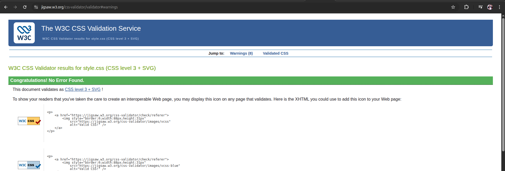
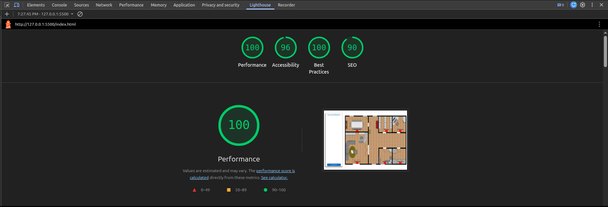

# Espace de Travail Virtuel

Application légère côté client pour la gestion du personnel, réalisée en HTML, CSS et JavaScript pur. Ce projet permet d'ajouter des profils de collaborateurs, de stocker les données dans `localStorage`, d'affecter des employés à des zones (salles) et d'afficher les détails de leur expérience.

**Fonctionnalités principales**
- Ajouter des profils de collaborateurs (nom, rôle, URL photo, email, téléphone) et plusieurs entrées d'expérience.
- Persistance des données côté client via `localStorage` (avec une copie de sauvegarde pour restauration simple).
- Interface interactive pour affecter/retirer des employés des zones.
- Modal de détails pour consulter le profil et l'expérience d'un collaborateur.
- Validation basique des champs (email, téléphone, extension d'image, champs d'expérience).

**Technologies**
- HTML/CSS : `index.html`, `style.css`
- JavaScript (ES6) : `main.js` (sans framework)

**Démarrage**

- Cloner ou télécharger le dépôt et ouvrir le dossier du projet.

- Exécution rapide (ouverture locale) :
	- Double-cliquer sur `index.html` ou l'ouvrir depuis votre navigateur.

- Recommandé : lancer un serveur statique pour éviter les problèmes liés à `file://` :

```bash
# Depuis la racine du projet
python3 -m http.server 8000
# Ouvrir ensuite http://localhost:8000
```

**Utilisation**
- Cliquer sur « Add New worker » pour ouvrir le modal d'ajout.
- Remplir les champs (nom, rôle, URL image, email, téléphone). Utiliser « Add Experience » pour ajouter des blocs d'expérience.
- Les données sont validées puis enregistrées dans `localStorage`.
- Cliquer sur l'image d'un collaborateur pour afficher le modal de détails.
- Utiliser l'interface « Choose Employee » pour affecter des collaborateurs aux zones. Les employés affectés sont retirés de la liste disponible.
- Cliquer sur le bouton `x` pour renvoyer un collaborateur affecté vers la liste disponible.

**Structure du projet**
- `index.html` — Markup principal et modals.
- `style.css` — Styles du projet.
- `main.js` — Logique applicative (validation, stockage, affectation).
- `photo/` — Ressources images (exemples).
- `README.md` — Documentation.

**Persistance des données & remarques**
- Clés utilisées dans `localStorage` :
	- `worker` — liste actuelle des collaborateurs disponibles.
	- `worker_backup` — copie maître utilisée pour restaurer un collaborateur affecté.
	- `id` — compteur pour les nouveaux collaborateurs.
- Pour réinitialiser l'état lors des tests : ouvrir les DevTools > Console et exécuter `localStorage.clear()` puis recharger la page.
- La validation dans `main.js` est basique — envisager d'améliorer les regex et l'UX d'erreur en production.

**Améliorations suggérées**
- Support d'upload d'image et stockage serveur des photos.
- Meilleure gestion des erreurs par champ (messages individuels).
- Accessibilité : labels ARIA, navigation clavier, gestion du focus.
- Refactoriser le JS en modules pour améliorer la maintenabilité.
- Ajouter des tests et une API serveur (Node/Express) pour persistance côté back-end.

**Contribuer**
- Les contributions sont bienvenues : ouvrir une issue ou soumettre une pull request.

**Licence**
- Aucune licence fournie. Pour rendre le projet open-source, ajoutez un fichier `LICENSE` (par ex. MIT). Si vous le souhaitez, je peux ajouter un fichier `LICENSE` MIT pour vous.

**Contact**
- Pour des questions ou du support, ouvrez une issue dans le dépôt ou contactez l'auteur du projet.

**Validation W3C Html**
- 

**Validation W3C Css**
- 

**Rapport Lighthouse**
- 

**Déploiement — GitHub Pages**
- Démo en ligne : https://elmakhtarlaarif.github.io/Virtual_Workspace/
